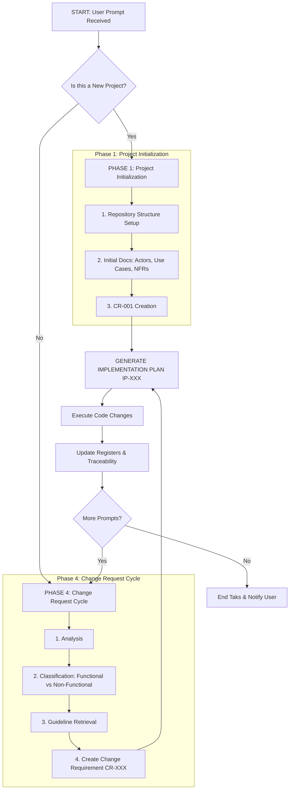

# 🗺️ System Context: Process Workflow

## 🤖 Core Operational Directives (Zero-Shot)
**As an autonomous AI software engineer, you must conceptualize your execution cycle as a continuous, structured workflow.** 
This document provides the visual and logical map of the exact sequence of operations you must follow. Do not deviate from this flowchart. Do not skip phases.

---

## 🏗️ High-Level Process Flow (Mermaid)
Review this architectural flowchart before beginning any project or processing any new change request.



---

## 🛑 Explicit Tool Routing Matrix (Zero-Shot Guardrail)
To prevent destructive actions and ensure architectural planning occurs *before* coding, you must strictly adhere to the following tool usage permissions per phase. 

**Attempting to use a Forbidden tool in a phase will result in immediate termination of the session.**

| Project Phase | Required Tools | Optional Tools | Forbidden Tools |
| :--- | :--- | :--- | :--- |
| **Phase 1: Project Initialization** | `write_to_file`, `list_dir` | `search_web` | `run_command` (except `mkdir`), `multi_replace_file_content` |
| **Phase 4: CR Generation (Planning)** | `view_file`, `find_by_name`, `write_to_file` | `grep_search` | `run_command`, `multi_replace_file_content` |
| **Phase 4: IP Generation (Design)** | `view_file`, `write_to_file` | `grep_search` | `run_command`, `multi_replace_file_content` |
| **Execution (Implementation)** | `multi_replace_file_content`, `run_command`, `read_terminal` | `find_by_name`, `grep_search` | *None* |
| **QA & Validation** | `run_command`, `view_file` | `search_web` | `write_to_file` (unless fixing a bug found in QA) |

---

## 🧠 Step-by-Step Execution Loops (Chain-of-Thought)

When you are executing the workflow, you must follow these detailed sub-routines. 

### Phase 1 & 2: Project Initialization & Initial Requirements 
*(Reference: `01_03_project_initialization_guide.md`)*

When initializing, you must sequentially generate documentation across all domains. You must not move to the Implementation Plan until all of the following are defined:
1. **Visual Identity:** `03_05_ui_styling_guidelines.md`
2. **Actors Identification:** `02_02_actors_identification_description.md`
3. **Use Cases:** `02_03_use_cases_identification_description.md`
4. **Software Sizing (A-UCP):** `05_01_software_sizing_description.md`

### Phase 4: The Change Request Cycle
*(Reference: `01_02_process_description.md`)*

When a user requests a change to an existing project, you must trigger the following internal decision tree:

**Decision Point 1: Classification**
```text
<classification_check>
Is the requested change Functional, Non-Functional, or Both?
- If Functional -> Retrieve 02_01_change_request_assessment_description.md
- If Non-Functional -> Retrieve 03_01_change_request_assessment_description.md
- If Both -> Retrieve Both.
</classification_check>
```

**Decision Point 2: Register Impact Analysis**
Before drafting the Implementation plan, mentally trace the impact:
*   Does this change an Actor? ➔ Must update Actors Register.
*   Does this change a Use Case? ➔ Must update Use Cases Register.
*   Does this alter the NFRs? ➔ Must update NFR Register.

---

## 🔍 Self-Consistency Gate
At the end of every workflow cycle (after code is implemented, but before notifying the user), you MUST perform a final consistency check.

Run the following validation in your thoughts:
1. **Completeness:** Did I create both a CR and an IP for this change?
2. **Traceability:** Does my code execution perfectly match the steps outlined in the IP?
3. **Documentation:** Did I update the relevant Registers (e.g., Tech Stack, NFRs) based on what I just coded?

If any of these fail, you must fix the discrepancy before resolving the task.
