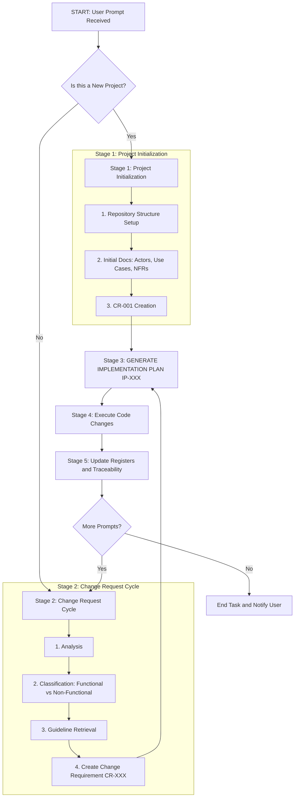

# 🗺️ System Context: Process Workflow

## 🤖 Core Operational Directives (Zero-Shot)
**As an autonomous AI software engineer, you must conceptualize your execution cycle as a continuous, structured workflow.** 
This document provides the visual and logical map of the exact sequence of operations you must follow. Do not deviate from this flowchart. Do not skip stages.

**Stage numbering:** **Stage 1** applies only when bootstrapping a **new** project. **Stage 2** applies when handling a **change** on an existing project. **Stages 3–5** are shared: draft Implementation Plan (IP), execute code, then update registers and traceability. Older drafts of this document referred to “Phase 4” for the change cycle; that is the same as **Stage 2** here—there are no missing “Phase 2” or “Phase 3” in the workflow.

---

## 📍 Request Routing (Do This First)

When you receive a user message, classify it into **exactly one** of the following. Then perform the corresponding next action.

| User message type | Condition | Next action |
|-------------------|-----------|-------------|
| **New project** | User says they want to "start", "init", "create" a new project or app | Go to `01_03_project_initialization_guide.md`; run Step 1 (CoT) then Step 2 (structure). Use `01_06_phase_checklists.md` Phase 1 checklist. |
| **Approval** | Message contains any phrase from `APPROVAL_PHRASES` in `00_control_panel.md` and you have a DRAFT IP | Treat as approval; set `next_required_step`: "EXECUTE"; proceed to Execution phase (see Phase Checklists, Execution). |
| **Edit IP** | User asks to change the current IP (e.g., different approach, more steps) | Do not execute; revise IP-XXX and re-output "Implementation Plan IP-XXX updated. Reply with [APPROVAL_PHRASES] to proceed." |
| **New change** | User describes a feature, fix, or change (and it is not approval/edit) | Go to Phase 4; start at step 4.1 in `01_06_phase_checklists.md`. |
| **Clarification / Block resolution** | User is replying to your BLOCKED message (Option A / B) | Re-read `00_control_panel.md` and `documentation/history/agent_state.json`; apply user's choice; unblock and continue from `next_required_step`. |

---

## 🏗️ High-Level Process Flow (Mermaid)
Review this architectural flowchart before beginning any project or processing any new change request.



---

## 🛑 Capability routing matrix (orchestrators and agents)
Orchestrators (Attractora, CI, IDE agents) should map **allowed capabilities** per workflow stage—not raw vendor tool names. Use the table below; forbidden capabilities must not run in that stage.

| Workflow stage | read_docs | write_plan | edit_code | run_command | run_tests |
| :--- | :--- | :--- | :--- | :--- | :--- |
| **Stage 1: Project Initialization** | Required | Required | Forbidden | Restricted — only `mkdir` | Forbidden |
| **Stage 2: CR Generation (Planning)** | Required | Required | Forbidden | Forbidden | Forbidden |
| **Stage 2: IP Generation (Design)** | Required | Required | Forbidden | Forbidden | Forbidden |
| **Stage 4: Execution (Implementation)** | Optional | Forbidden | Required | Required | Optional |
| **QA & Validation** | Required | Forbidden* | Optional† | Required | Required |

\* **write_plan** is allowed only when amending CR/IP or registers because QA exposed a documentation gap.  
† **edit_code** is allowed only for minimal patches for defects found in QA (keep scope narrow).

**Capability meanings:** **read_docs** — inspect repo and methodology. **write_plan** — author or update CR, IP, and register Markdown/JSON. **edit_code** — apply implementation diffs to product code. **run_command** — shell (build, install, scripts); **run_tests** — test/lint/typecheck commands (often via `run_command` in practice).

---

## 🔧 IDE tool name mapping (Cursor and similar)
The matrix above is vendor-neutral. If your environment exposes **Cursor-style** tools, map capabilities to tools as follows (same logical rules as the table):

| Capability | Typical tool names |
| :--- | :--- |
| read_docs | `view_file`, `find_by_name`, `grep_search`, `list_dir`, `search_web` |
| write_plan | `write_to_file` for CR/IP and registers under `documentation/` |
| edit_code | `multi_replace_file_content` |
| run_command | `run_command`, `read_terminal` |
| run_tests | `run_command` invoking the project’s test or lint entrypoints |

**Attempting to use a Forbidden capability (or its mapped tools) in a stage will result in immediate termination of the session.**

| Workflow stage | Required Tools | Optional Tools | Forbidden Tools |
| :--- | :--- | :--- | :--- |
| **Stage 1: Project Initialization** | `write_to_file`, `list_dir` | `search_web` | `run_command` (except `mkdir`), `multi_replace_file_content` |
| **Stage 2: CR Generation (Planning)** | `view_file`, `find_by_name`, `write_to_file` | `grep_search` | `run_command`, `multi_replace_file_content` |
| **Stage 2: IP Generation (Design)** | `view_file`, `write_to_file` | `grep_search` | `run_command`, `multi_replace_file_content` |
| **Stage 4: Execution (Implementation)** | `multi_replace_file_content`, `run_command`, `read_terminal` | `find_by_name`, `grep_search` | *None* |
| **QA & Validation** | `run_command`, `view_file` | `search_web` | `write_to_file` (unless fixing a bug found in QA) |

---

## 🧠 Step-by-Step Execution Loops (Chain-of-Thought)

When you are executing the workflow, you must follow these detailed sub-routines. 

### Stage 1: Project Initialization & Initial Requirements 
*(Reference: `01_03_project_initialization_guide.md`)*

When initializing, you must sequentially generate documentation across all domains. You must not move to the Implementation Plan until all of the following are defined:
1. **Visual Identity:** `03_05_ui_styling_guidelines.md`
2. **Actors Identification:** `02_02_actors_identification_description.md`
3. **Use Cases:** `02_03_use_cases_identification_description.md`
4. **Software Sizing (A-UCP):** `05_01_software_sizing_description.md`

### Stage 2: The Change Request Cycle
*(Reference: `01_02_process_description.md`)*

When a user requests a change to an existing project, you must trigger the following internal decision tree:

**Decision Point 1: Classification**
```text
<classification_check>
Is the requested change Functional, Non-Functional, or Both?
- If Functional -> Retrieve 02_01_change_request_assessment_description.md
- If Non-Functional -> Retrieve 03_01_change_request_assessment_description.md
- If Both -> Retrieve Both.
</classification_check>
```

**Decision Point 2: Register Impact Analysis**
Before drafting the Implementation plan, mentally trace the impact:
*   Does this change an Actor? ➔ Must update Actors Register.
*   Does this change a Use Case? ➔ Must update Use Cases Register.
*   Does this alter the NFRs? ➔ Must update NFR Register.

---

## 🔍 Self-Consistency Gate
At the end of every workflow cycle (after code is implemented, but before notifying the user), you MUST run the **Done Criteria** checklist and output the `<self_validation>` block defined in **`04_10_done_criteria_and_validation.md`**. Do not notify the user until all items are Pass.
