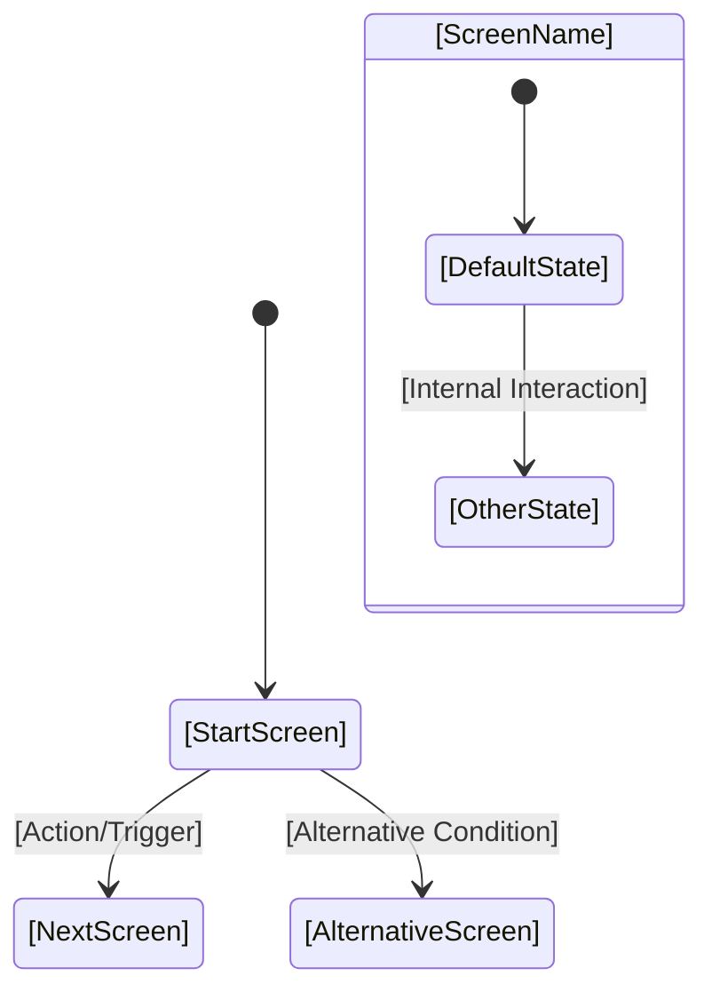

# UI Styling and Guidelines Description

## Overview

The UI Styling and Guidelines documentation provides comprehensive specifications for the visual design, interaction patterns, and accessibility standards of the user interface. This documentation serves as a critical reference for maintaining consistency, ensuring accessibility, and guiding implementation decisions. It is based on internationally recognized standards and industry best practices to ensure the UI meets both usability and accessibility requirements.

## Purpose

The UI Styling and Guidelines documentation serves multiple critical purposes:

1. **Consistency**: Ensures visual and interactive consistency across the entire application
2. **Accessibility Compliance**: Documents adherence to accessibility standards (WCAG, ARIA)
3. **Implementation Guidance**: Provides clear specifications for developers and AI agents
4. **Design System Foundation**: Establishes the foundation for a reusable design system
5. **Change Management**: Supports impact analysis when UI changes are requested
6. **Quality Assurance**: Enables validation of UI implementations against documented guidelines

## Standards and References

### Primary Standards

The UI Styling and Guidelines documentation should reference and comply with the following internationally recognized standards:

1. **ISO 9241 - Ergonomics of Human-System Interaction**
   - Comprehensive international standard for UI ergonomics
   - Covers dialogue principles, presentation of information, and user guidance
   - Provides guidance on usability and human-centered design
   - Reference: ISO 9241 series (multiple parts covering different aspects)

2. **W3C WCAG (Web Content Accessibility Guidelines)**
   - De facto standard for web accessibility
   - Current versions: WCAG 2.1 and WCAG 2.2
   - Defines accessibility requirements (Level A, AA, AAA)
   - Reference: https://www.w3.org/WAI/WCAG21/quickref/

3. **W3C ARIA (Accessible Rich Internet Applications)**
   - Standard for accessible interactive components
   - Defines roles, states, and properties for UI components
   - Reference: https://www.w3.org/WAI/ARIA/

### Additional References

4. **Design System Patterns**
   - Material Design (Google) - for component patterns and interaction guidelines
   - Human Interface Guidelines (Apple) - for platform-specific guidelines
   - Carbon Design System (IBM) - for enterprise application patterns

5. **OMG IFML (Interaction Flow Modeling Language)**
   - Standardized modeling language for UI structure and behavior
   - Useful for documenting interaction flows and user journeys

## UI Styling and Guidelines Documentation Structure

### Core Sections

The UI Styling and Guidelines documentation should be organized into the following sections:

1. **Design Tokens**
   - Colors
   - Typography
   - Spacing and Layout
   - Shadows and Effects
   - Animation and Transitions

2. **Component Library**
   - Basic Components (buttons, inputs, labels)
   - Complex Components (forms, tables, modals)
   - Navigation Components
   - Feedback Components (alerts, notifications)

3. **Layout Patterns**
   - Page Layouts
   - Grid Systems
   - Responsive Breakpoints
   - Container Patterns

4. **Interaction Patterns**
   - User Flows
   - Navigation Patterns
   - Form Interactions
   - Error Handling Patterns

5. **Accessibility Guidelines**
   - WCAG Compliance Requirements
   - ARIA Usage Guidelines
   - Keyboard Navigation
   - Screen Reader Support

6. **Usage Guidelines**
   - When to Use Each Component
   - Do's and Don'ts
   - Best Practices
   - Common Patterns

## Design Tokens Documentation

### Color System

```markdown
**Color Token ID**: [COLOR-XXX]
**Color Name**: [Name]
**Category**: [Primary/Secondary/Action/Neutral/Semantic/Status]

**Color Values**:
- Hex: [#RRGGBB]
- RGB: rgb(r, g, b)
- HSL: hsl(h, s%, l%)
- CSS Variable: var(--color-name)

**Usage**:
[When and how this color should be used]

**Accessibility**:
- Contrast Ratio: [Ratio against white/black]
- WCAG Compliance: [AA/AAA/Not Compliant]
- Usage Restrictions: [Any restrictions for accessibility]

**Variants**:
- Light: [Variant for light backgrounds]
- Dark: [Variant for dark backgrounds]
- Hover: [Hover state color]
- Active: [Active state color]
- Disabled: [Disabled state color]

**Related Colors**:
- [Color ID]: [Relationship]

**Notes**:
[Additional information]
```


### Implementation Mandate: Metadata Theme Object
All design tokens must be implemented as a loadable **Metadata Theme Object** (JSON/YAML/Config).
Components must reference tokens via this object (e.g., `Theme.Colors.Primary`), NEVER hardcoded values.

### Color Category Usage Guidelines

#### Primary Color
- **Purpose**: Main brand/identity color and default button color
- **Button Usage**: All buttons in a button set should use Primary color by default
- **Usage**: Primary actions, main navigation elements, brand identity elements
- **Example**: All buttons in a form (Save, Cancel, Delete) use Primary color

#### Secondary Color
- **Purpose**: Supporting brand color for secondary actions
- **Button Usage**: Used for secondary actions when needed, but not the default for button sets
- **Usage**: Supporting actions, alternative navigation paths, complementary elements
- **Example**: Secondary navigation items, alternative action buttons

#### Action Color
- **Purpose**: Special action button color for optional, distinctive actions
- **Button Usage**: One optional button per button set can use Action color to stand out
- **Usage**: Special actions that need visual distinction (e.g., Export, Download, Special Operations)
- **Pattern**: In a button set, all buttons default to Primary color, with one optional button using Action color
- **Example**: In a form with "Save", "Cancel", "Delete" (all Primary), an optional "Export" button uses Action color

#### Neutral Color
- **Purpose**: Grayscale colors for backgrounds, text, borders, and structural elements
- **Usage**: Backgrounds, text colors, borders, dividers, shadows
- **Example**: White backgrounds, gray text, border colors

#### Semantic Color
- **Purpose**: Colors that convey meaning or state (Success, Warning, Error, Info)
- **Usage**: Status messages, validation feedback, informational alerts
- **Example**: Green for success messages, red for errors, yellow for warnings

#### Status Color
- **Purpose**: Colors indicating system or item status
- **Usage**: Status indicators, state badges, progress indicators
- **Example**: Green dot for online status, gray for offline

### Button Color Pattern

The standard button color pattern follows this logic:

- **Default Pattern**: All buttons in a button set use **Primary** color
- **Optional Action Button**: One optional button per set can use **Action** color for visual distinction
- **Rationale**: This pattern ensures visual consistency (most buttons are Primary) while allowing one special action to stand out when needed

**Example Button Sets**:
- Form buttons: "Save" (Primary), "Cancel" (Primary), "Delete" (Primary), "Export" (Action - optional)
- Dialog buttons: "OK" (Primary), "Cancel" (Primary), "Advanced Options" (Action - optional)
- Toolbar buttons: All standard actions (Primary), one special action (Action - optional)

### Typography System

```markdown
**Typography Token ID**: [TYPO-XXX]
**Type Scale Name**: [Name]
**Category**: [Heading/Body/Caption/Label]

**Font Family**:
- Primary: [Font name]
- Fallback: [Fallback fonts]
- CSS Variable: var(--font-family-name)

**Font Sizes**:
- Desktop: [Size with unit]
- Tablet: [Size with unit]
- Mobile: [Size with unit]
- CSS Variable: var(--font-size-name)

**Font Weights**:
- Available: [List of weights]
- Default: [Default weight]
- CSS Variable: var(--font-weight-name)

**Line Height**:
- Value: [Line height value]
- CSS Variable: var(--line-height-name)

**Letter Spacing**:
- Value: [Letter spacing value]
- CSS Variable: var(--letter-spacing-name)

**Usage**:
[When and how this typography should be used]

**Accessibility**:
- Minimum Size: [Minimum readable size]
- Line Length: [Optimal line length]
- WCAG Compliance: [Compliance level]

**Examples**:
[Visual examples or code snippets]

**Notes**:
[Additional information]
```

### Spacing System

```markdown
**Spacing Token ID**: [SPACE-XXX]
**Spacing Name**: [Name]
**Size**: [Value with unit]
**CSS Variable**: var(--spacing-name)

**Usage**:
[When and how this spacing should be used]

**Scale Position**:
[Position in the spacing scale]

**Related Spacings**:
- [Spacing ID]: [Relationship]

**Notes**:
[Additional information]
```

## Component Documentation Template

### Standard Component Template

```markdown
**Component ID**: [COMP-XXX]
**Component Name**: [Name]
**Category**: [Basic/Complex/Navigation/Feedback]
**Status**: [Active/Deprecated/Planned]

**Description**: 
[Brief description of the component and its purpose]

**Visual Specification**:
- [Link to design mockup or image]
- Dimensions: [Width x Height]
- States: [Default/Hover/Active/Disabled/Focus/Error]

**Design Tokens Used**:
- Colors: [List of color tokens]
- Typography: [List of typography tokens]
- Spacing: [List of spacing tokens]
- Shadows: [List of shadow tokens]

**Accessibility**:
- ARIA Roles: [List of ARIA roles]
- ARIA Properties: [List of ARIA properties]
- Keyboard Navigation: [Keyboard interaction description]
- Screen Reader Support: [Screen reader behavior]
- WCAG Compliance: [Compliance level and requirements]

**Props/Attributes**:
| Name | Type | Required | Default | Description |
|------|------|----------|---------|-------------|
| [prop] | [type] | [yes/no] | [default] | [description] |

**Usage Guidelines**:
- When to Use: [Scenarios where this component is appropriate]
- When Not to Use: [Scenarios to avoid]
- Best Practices: [Recommended usage patterns]
- Common Patterns: [Common use cases]

**Code Example**:
```[language]
[Code example showing usage]
```

**Variants**:
- [Variant 1]: [Description]
- [Variant 2]: [Description]

**Related Components**:
- [Component ID]: [Relationship type]

**Dependencies**:
- [Component ID]: [Components this depends on]

**Browser Support**:
[Browser compatibility information]

**Implementation Notes**:
[Technical implementation details]

**Change History**:
| Date | Version | Change | Rationale |
|------|---------|--------|-----------|
| [Date] | [Version] | [Change] | [Rationale] |

**Notes**:
[Additional information]
```

## Layout Patterns Documentation

### Layout Pattern Template

```markdown
**Layout Pattern ID**: [LAYOUT-XXX]
**Pattern Name**: [Name]
**Category**: [Page/Container/Grid/Responsive]

**Description**: 
[Description of the layout pattern]

**Structure**:
[Visual or textual description of layout structure]

**Breakpoints**:
| Breakpoint | Min Width | Max Width | Layout Behavior |
|------------|-----------|-----------|-----------------|
| Mobile | [Width] | [Width] | [Behavior] |
| Tablet | [Width] | [Width] | [Behavior] |
| Desktop | [Width] | [Width] | [Behavior] |

**Grid System**:
- Columns: [Number of columns]
- Gutter: [Gutter size]
- Margins: [Margin sizes]

**Components Used**:
- [Component ID]: [Role in layout]

**Accessibility**:
- Reading Order: [Logical reading order]
- Focus Management: [Focus behavior]
- Responsive Behavior: [Accessibility in different screen sizes]

**Usage Guidelines**:
[When and how to use this layout]

**Code Example**:
[Code example]

**Related Patterns**:
- [Pattern ID]: [Relationship]

**Notes**:
[Additional information]
```

## Interaction Patterns Documentation

### Interaction Pattern Template

```markdown
**Interaction Pattern ID**: [INTERACT-XXX]
**Pattern Name**: [Name]
**Category**: [Navigation/Form/Feedback/Data Entry]

**Description**: 
[Description of the interaction pattern]

**User Flow**:
1. [Step 1]
2. [Step 2]
3. [Step 3]

**Components Involved**:
- [Component ID]: [Role in interaction]

**States and Transitions**:
- [State 1] → [State 2]: [Trigger and behavior]
- [State 2] → [State 3]: [Trigger and behavior]

**Accessibility**:
- Keyboard Navigation: [Keyboard interaction flow]
- Screen Reader Announcements: [What is announced]
- Focus Management: [Focus behavior during interaction]
- Error Handling: [How errors are communicated]

**Animation/Transitions**:
- Duration: [Duration]
- Easing: [Easing function]
- Purpose: [Why this animation exists]

**Usage Guidelines**:
[When and how to use this pattern]

**Related Patterns**:
- [Pattern ID]: [Relationship]

**Notes**:
[Additional information]
```

## Accessibility Guidelines Documentation

### WCAG Compliance Documentation

```markdown
**WCAG Requirement ID**: [WCAG-XXX]
**WCAG Criterion**: [Criterion number and name]
**Level**: [A/AA/AAA]
**Status**: [Compliant/Partially Compliant/Non-Compliant]

**Requirement Description**: 
[Description of the WCAG requirement]

**Implementation**:
[How this requirement is implemented in the UI]

**Components Affected**:
- [Component ID]: [How it complies]
- [Component ID]: [How it complies]

**Testing Method**:
[How to test compliance with this requirement]

**Related Guidelines**:
- [Guideline ID]: [Relationship]

**Notes**:
[Additional information]
```

### ARIA Usage Guidelines

```markdown
**ARIA Pattern ID**: [ARIA-XXX]
**Pattern Name**: [Name]
**ARIA Specification**: [Reference to ARIA spec]

**Description**: 
[Description of the ARIA pattern]

**When to Use**:
[Scenarios where this ARIA pattern is appropriate]

**Implementation**:
[Code example showing ARIA implementation]

**Components Using This Pattern**:
- [Component ID]: [How it's used]

**Browser Support**:
[Browser compatibility]

**Related Patterns**:
- [Pattern ID]: [Relationship]

**Notes**:
[Additional information]
```

## UI Styling and Guidelines Registration Process

### Step 1: Standards Compliance Review

1. **Review ISO 9241**: Identify relevant parts of ISO 9241 that apply to the project
2. **Review WCAG**: Determine target WCAG compliance level (typically AA)
3. **Review ARIA**: Identify ARIA patterns needed for interactive components
4. **Document Compliance**: Record how the UI complies with each standard

### Step 2: Design Token Documentation

1. **Extract Design Tokens**: Identify all design tokens from design specifications
2. **Document Colors**: Document color system with accessibility information
3. **Document Typography**: Document typography scale and usage
4. **Document Spacing**: Document spacing system and scale
5. **Document Other Tokens**: Document shadows, animations, and other design tokens

### Step 3: Component Documentation

1. **Inventory Components**: List all UI components used in the system
2. **Document Specifications**: For each component, document:
   - Visual specifications
   - Design tokens used
   - Accessibility features
   - Usage guidelines
   - Code examples

### Step 4: Pattern Documentation

1. **Document Layout Patterns**: Document page layouts and container patterns
2. **Document Interaction Patterns**: Document user flows and interaction patterns
3. **Document Responsive Behavior**: Document how patterns adapt to different screen sizes

### Step 5: Accessibility Documentation

1. **Document WCAG Compliance**: For each WCAG requirement, document compliance status
2. **Document ARIA Usage**: Document ARIA patterns used throughout the UI
3. **Document Keyboard Navigation**: Document keyboard navigation patterns
4. **Document Screen Reader Support**: Document screen reader announcements and behavior

### Step 6: Validation

Validate the UI Styling and Guidelines documentation by:

1. **Completeness Check**: Ensure all components and patterns are documented
2. **Standards Compliance**: Verify references to ISO 9241, WCAG, and ARIA
3. **Accessibility Verification**: Confirm accessibility information is complete
4. **Consistency Check**: Ensure consistent formatting and structure
5. **Code Example Verification**: Verify code examples are accurate and current

## Integration with Change Management

### UI Change Assessment

When a change request involves UI modifications:

1. **Impact Analysis**: Identify which components, patterns, or design tokens are affected
2. **Accessibility Impact**: Assess impact on WCAG compliance and accessibility
3. **Design Token Updates**: Update design token documentation if needed
4. **Component Updates**: Update component documentation
5. **Pattern Updates**: Update interaction or layout patterns if affected
6. **Standards Review**: Verify continued compliance with ISO 9241, WCAG, and ARIA

### UI Addition Process

When adding new UI components or patterns:

1. **Standards Compliance**: Ensure new components comply with ISO 9241, WCAG, and ARIA
2. **Design Token Usage**: Use existing design tokens or document new ones
3. **Documentation**: Add complete documentation following templates
4. **Accessibility Testing**: Verify accessibility compliance
5. **Register Update**: Add to UI Styling and Guidelines register

## Integration with Code Entropy

### UI and Code Entropy Considerations

UI styling and guidelines impact code entropy:

1. **Design Token Centralization**: Centralized design tokens reduce entropy when making style changes
2. **Component Reusability**: Reusable components reduce entropy for UI changes
3. **Pattern Consistency**: Consistent patterns reduce the number of components that need updates
4. **Style System Organization**: Well-organized style systems minimize entropy for styling changes

### Documentation Requirements

When documenting UI in the context of code entropy:

- **Token Dependencies**: Document which components depend on which design tokens
- **Component Dependencies**: Document dependencies between UI components
- **Change Impact**: Document how UI changes affect component organization
- **Entropy Implications**: Note entropy implications of UI design decisions

## Best Practices

1. **Standards First**: Always reference ISO 9241, WCAG, and ARIA standards
2. **Accessibility by Design**: Document accessibility from the start, not as an afterthought
3. **Design Token Consistency**: Use design tokens consistently across all components
4. **Component Reusability**: Document reusable components to reduce duplication
5. **Visual Examples**: Include visual examples or references for all components
6. **Code Examples**: Provide accurate, tested code examples
7. **Regular Updates**: Update documentation with each UI change
8. **Version Control**: Track versions of UI components and guidelines
9. **Testing Documentation**: Document how to test components and accessibility
10. **Clear Guidelines**: Provide clear "when to use" and "when not to use" guidance

## UI Styling and Guidelines Register Template

### Complete Register Structure

```markdown
# UI Styling and Guidelines Register

**Project**: [Project Name]
**Last Updated**: [Date]
**Version**: [Register Version]
**WCAG Compliance Level**: [A/AA/AAA]
**ISO 9241 Compliance**: [Compliant/Partially Compliant]

## Standards Compliance

### ISO 9241 Compliance
[Summary of ISO 9241 compliance]

### WCAG Compliance
[Summary of WCAG compliance by level]

### ARIA Usage
[Summary of ARIA patterns used]

## Design Tokens

### Colors
[Color tokens using template]

### Typography
[Typography tokens using template]

### Spacing
[Spacing tokens using template]

### Other Tokens
[Shadows, animations, etc.]

## Component Library

### Basic Components
[Component entries using template]

### Complex Components
[Component entries using template]

### Navigation Components
[Component entries using template]

### Feedback Components
[Component entries using template]

## Layout Patterns

[Layout pattern entries using template]

## UI Navigation Modeling (Mermaid)

To ensure clear communication of user flows and navigation requirements between the User and AI Agents, we adopt **Mermaid.js State Diagrams** as the standard notation.

### Implementation Mandate: Router Configuration
The Mermaid diagram above represents a **Router Configuration** (Metadata).
Navigation logic in code must execute this configuration (e.g., a State Machine or Router definition file), not hardcoded path strings.

### Navigation Diagram Template



**Key Elements:**
*   `[*]` : Entry/Exit points
*   `-->`: Transitions
*   `:` : Label for Trigger/Action (e.g., "Click Save", "Success")

## UI Screen Specification

For specifying detailed screen requirements, use the following textual wireframing notation.

### Textual Wireframing Syntax

*   **Containers**:
    *   `[Screen Name]` : Screen Title/Page
    *   `+--- [Section Name] ---+` : Section Divider
*   **Interactive Elements**:
    *   `[ Button Label ]` : Button
    *   `{ Input Label }` : Text Input Field
    *   `( ) Radio` : Radio Button (Unselected)
    *   `(*) Radio` : Radio Button (Selected)
    *   `[ ] Checkbox` : Checkbox (Unchecked)
    *   `[x] Checkbox` : Checkbox (Checked)
    *   `v Dropdown v` : Dropdown Menu
*   **Navigation**:
    *   `| Link Label |` : Hyperlink

### Screen Specification Template

```markdown
**Screen ID**: [SCR-XXX]
**Screen Name**: [Name]
**Route**: [/path/to/screen]

**Wireframe**:
```text
+-------------------------------------------------------+
|  [Screen Name]                                        |
+-------------------------------------------------------+
|  { Search... }          [ Search ]                    |
|                                                       |
|  +--- User List ----------------------------------+   |
|  | Name            | Role          | Actions      |   |
|  |-----------------|---------------|--------------|   |
|  | User A          | Admin         | [Edit] [Del] |   |
|  | User B          | Viewer        | [Edit] [Del] |   |
|  +------------------------------------------------+   |
|                                                       |
|  [ < Prev ]   Page 1 of 5   [ Next > ]                |
+-------------------------------------------------------+
```

**Data Binding**:
*   `{Search}` -> `SearchQuery` (String)
*   `User List` -> `Users` (List<User>)

**Interactions**:
*   `[Search]` -> Triggers `SearchUsers()` -> Updates `User List`
*   `[Edit]` -> Navigates to `SCR-002` (Edit User)
```

## Interaction Patterns

[Interaction pattern entries using template]

## UI Navigation

[Mermaid Navigation Diagrams]

## Screen Specifications

[Screen Specification entries using template]

## Accessibility Guidelines

### WCAG Requirements
[WCAG compliance entries using template]

### ARIA Patterns
[ARIA pattern entries using template]

### Keyboard Navigation
[Keyboard navigation documentation]

### Screen Reader Support
[Screen reader support documentation]

## Change History

| Date | Change Type | Component/Pattern | Description | Rationale |
|------|-------------|-------------------|-------------|-----------|
| [Date] | [Added/Updated/Removed] | [ID] | [Description] | [Rationale] |
```


## Generative Design Workflow

This methodology leverages AI agents to generate visual concepts and detailed specifications in a two-phase process.

### Phase 1: Generative Styling (Visual Identity)
**Timing**: Before `Actors Identification`.
**Goal**: Define the visual "Look & Feel" (Theme).

**Agent Workflow**:
1.  **Context**: Read the User's high-level project description/idea.
2.  **Action**: Generate 2 distinct "Mood Board" or "Home Screen Concept" images (e.g., one "Modern/Clean", one "Bold/Creative").
    *   *Prompt Pattern*: "Generate a high-fidelity UI concept for [App Name] with a [Style] aesthetic. Show a Dashboard screen. [Light/Dark] mode."
3.  **User Interaction**: Ask user to select the preferred concept.

    **Look Principles (Style Selection)**:
    When generating concepts, the Agent handles the look and feel based on the product characteristics and market. The Agent MUST select from the following 5 "Look Principles":
    
    *   **Minimalistic**: For emotionally neutral apps that promote concentration and task focus (e.g., Productivity, SaaS).
    *   **Neon**: For modern, goal-oriented, and high-energy moods (e.g., Fitness, Gaming, Crypto).
    *   **Fiesta**: For excitement, emotion, and celebration (e.g., Events, Social functionality).
    *   **Classic**: For formal, confidence, and trust moods (e.g., Banking, Legal, Enterprise).
    *   **Feminine**: For social, soft, and emotional moods (e.g., Lifestyle, Wellness).

    *Agent Instruction*: Generate one visual concept for EACH of the 5 Look Principles to provide the user with a comprehensive range of stylistic options.

4.  **Output**: Create the **Metadata Theme Object** (JSON) based on the selected image's colors, typography, and spacing.

### Phase 2: Generative Interaction (Detailed Design)
**Timing**: After `Functional Requirements` and `Software Sizing`.
**Goal**: Design specific screens and navigation flows.

**Agent Workflow**:
1.  **Context**: Read `Theme Object`, `Use Cases`, and `Functional Requirements`.
2.  **Action**: For each major Use Case, generate a "Screen Mockup" image applying the Theme.
3.  **Derivation**:
    *   Convert Mockup -> **Screen Specification** (Textual Wireframe).
    *   Convert Flow -> **Router Configuration** (Mermaid).
4.  **Output**: Update the UI Guidelines Register with these specifications.

4.  **Output**: Update the UI Guidelines Register with these specifications.

### Style Implementation Recipes (Technical Feasibility)

When selecting or implementing a visual style, use the following technical recipes. Most modern effects are achievable with **Pure CSS** and do not require image assets.

| Style | CSS-Only? | Key CSS Properties | Implementation Difficulty |
| :--- | :--- | :--- | :--- |
| **Neumorphism** | ✅ Yes | `box-shadow` (multiple: light & dark), `background-color` (precise matching), `border-radius` | Medium (Requires precise color tuning) |
| **Glassmorphism** | ✅ Yes | `backdrop-filter: blur()`, `background: rgba(255,255,255, x)`, `border` (semi-transparent) | Low (Browser support is good) |
| **Claymorphism** | ✅ Yes | `box-shadow: inset` (inner glow/shadow), `border-radius` (high), `filter: drop-shadow` | Low |
| **Aurora UI** | ✅ Yes | `background-image: radial-gradient()`, `filter: blur()`, `position: absolute` (for blobs) | Medium (Performance consideration for animations) |
| **Neo-Brutalism** | ✅ Yes | `border: xpx solid black`, `box-shadow` (0 blur, hard offset), `font-weight: bold` | Very Low |

#### 1. Neumorphism Recipe
*   **Concept**: Elements appear extruded from the background (same color).
*   **Requirement**: Background and Element color must match exactly.
*   **Code**:
    ```css
    .neumorphic {
      background: #e0e0e0;
      box-shadow:  20px 20px 60px #bebebe, 
                  -20px -20px 60px #ffffff;
    }
    ```

#### 2. Glassmorphism Recipe
*   **Concept**: Frosted glass effect overlaying a background.
*   **Requirement**: Needs something behind it to blur.
*   **Code**:
    ```css
    .glass {
      background: rgba(255, 255, 255, 0.25);
      backdrop-filter: blur(4px);
      -webkit-backdrop-filter: blur(4px);
      border: 1px solid rgba(255, 255, 255, 0.18);
    }
    ```

#### 3. Claymorphism Recipe
*   **Concept**: Soft, 3D, inflated "clay" look.
*   **Requirement**: Light "inset" shadows and high border-radius.
*   **Code**:
    ```css
    .clay {
      background: #ebf5fc;
      border-radius: 32px;
      box-shadow: inset 8px 8px 16px 0px rgba(255, 255, 255, 0.6), 
                  inset -8px -8px 16px 0px rgba(0, 0, 0, 0.1),
                  10px 10px 20px rgba(0,0,0,0.1);
    }
    ```

#### 4. Aurora UI Recipe
*   **Concept**: Soft, blurred, moving gradients (like Northern Lights).
*   **Requirement**: Overlapping blurred distinct gradient shapes.
*   **Code**:
    ```css
    .aurora-bg {
      background-color: #ffffff;
      background-image: 
        radial-gradient(at 0% 0%, hsla(253,16%,7%,1) 0, transparent 50%), 
        radial-gradient(at 50% 0%, hsla(225,39%,30%,1) 0, transparent 50%), 
        radial-gradient(at 100% 0%, hsla(339,49%,30%,1) 0, transparent 50%);
      filter: blur(100px); /* The key to the effect */
    }
    ```

#### 5. Neo-Brutalism Recipe
*   **Concept**: Raw, unpolished, high contrast, non-conformist.
*   **Requirement**: Thick borders, hard shadows, vibrant/clashing colors.
*   **Code**:
    ```css
    .neo-brutal {
      background-color: #FF90E8;
      border: 3px solid #000000;
      box-shadow: 5px 5px 0px 0px #000000; /* No blur, solid offset */
    }
    ```

    ```

#### 6. Retro / ASCII (VGA) Recipe
*   **Concept**: Mimic old-school terminal interfaces.
*   **Requirement**: Monospace font is mandatory. Borders must be solid or double.
*   **Code**:
    ```css
    .retro-ascii {
      font-family: 'Courier New', monospace;
      background-color: #000084; /* VGA Blue */
      color: #FFFFFF;
      border: 4px double #FFFFFF; /* Mimics ASCII double lines */
      box-shadow: 10px 10px 0px #000000; /* Hard shadow */
      text-transform: uppercase;
    }
    /* CRT Scanline Overlay Effect (Optional) */
    .crt-overlay {
      background: linear-gradient(rgba(18, 16, 16, 0) 50%, rgba(0, 0, 0, 0.25) 50%);
      background-size: 100% 4px;
      pointer-events: none;
    }
    ```

#### 7. Windows 3.11 (Retro GUI) Recipe
*   **Concept**: Classic 16-bit graphical user interface.
*   **Requirement**: MS Sans Serif font (pixelated), "Chiseled" 3D borders, specific gray.
*   **Code**:
    ```css
    .win31 {
      font-family: 'MS Sans Serif', 'Pixel Sans', sans-serif;
      background-color: #C0C0C0; /* Classic Gray */
      color: #000000;
      border: 2px solid #FFFFFF; /* High-light */
      border-right-color: #000000; /* Shadow */
      border-bottom-color: #000000; /* Shadow */
      box-shadow: 1px 1px 0px #808080; /* Dark Gray Shadow */
    }
    .win31-title-bar {
      background-color: #000080; /* Navy Blue */
      color: #FFFFFF;
      font-weight: bold;
    }
    ```

### Dynamic Theming & Skinning Architecture

The **Metadata-Driven UI** architecture explicitly supports "Skinning" (runtime style switching).

**Mechanism**:
1.  **Abstraction**: Components do not have hardcoded styles. They reference **Semantic Tokens** (e.g., `var(--card-bg)`, `var(--shadow-elevation)`).
2.  **Definition**: The "Skin" is defined entirely within the **Theme Metadata Object** (JSON).
3.  **Switching**: Changing the active "Skin" is as simple as injecting a new JSON object into the Theme Provider.

**Example: Switching from Minimal to Neumorphic**

*   **Minimal Theme JSON**:
    ```json
    { "shadows": { "card": "0 2px 4px rgba(0,0,0,0.1)" }, "borderRadius": "8px", "bg": "#ffffff" }
    ```
*   **Neumorphic Theme JSON**:
    ```json
    { "shadows": { "card": "20px 20px 60px #bebebe, -20px -20px 60px #ffffff" }, "borderRadius": "30px", "bg": "#e0e0e0" }
    ```

**Result**: The *same* `<Card />` component renders completely differently based on the loaded JSON, without changing a single line of component code.

## Integration with AI Agent Context

The UI Styling and Guidelines documentation must be:

- **Included in AI Agent Context**: Provided to AI agents as part of their working context
- **Referenced in Implementation Plans**: Implementation Plans should reference relevant UI guidelines
- **Updated by AI Agents**: AI agents should update the documentation when making UI-related changes
- **Used for Code Generation**: AI agents should use the documentation to ensure generated UI code is consistent and accessible
- **Validated Against Standards**: AI agents should verify compliance with ISO 9241, WCAG, and ARIA standards

This UI Styling and Guidelines documentation ensures that all UI design decisions are properly documented, comply with international standards, and are available as context for AI agents and developers throughout the software development lifecycle.

