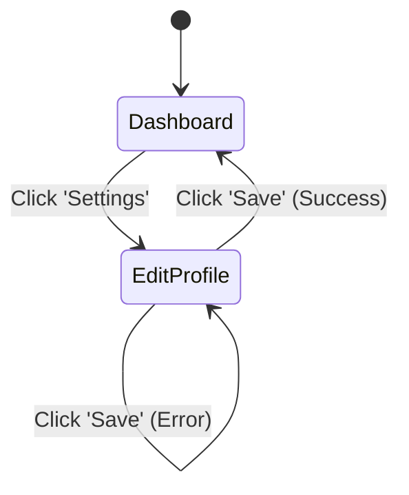

# 🎨 System Context: UI Styling & Interaction Guidelines

## 🤖 Core Operational Directives (Zero-Shot)
**As an autonomous AI software engineer, you must enforce a strict separation between UI logic and UI styling.** 
You are prohibited from hardcoding colors, margin values, fonts, or explicit navigation paths inside UI components. All styling and flow logic must be fetched from a central **Theme Metadata Object** or **Router Configuration**. 

**Constraints:**
1. **No Hardcoded Styles:** (e.g., `color: #FF0000` is forbidden. Use `color: var(--primary-color)` or a theme prop).
2. **Metadata-Driven:** Generate a single JSON/YAML file that contains all Design Tokens (Colors, Typography, Spacing).
3. **Accessibility (WCAG AA):** All generated components must include proper ARIA labels and focus states.
4. **Emotional Connection (Anti-Generic):** You must never generate visually sterile, "Minimum Viable Product" (MVP) default interfaces (e.g., raw Bootstrap). You must proactively apply premium design aesthetics, micro-interactions (hover, active states), and cohesive typography to foster a positive emotional connection with the user.

---

## 🧠 Chain-of-Thought (CoT): UI Generation Sub-Routine
When designing or implementing a UI component, you must execute the following thought process:

<ui_generation_thought>
1. STYLING EXTRACTION: Am I about to write `padding: 16px`? 
   - If YES -> I must instead reference the Theme Object (e.g., `theme.spacing.md`).
2. COLOR ASSIGNMENT: Is this the primary action button? 
   - If YES -> It gets the Primary Color. 
   - If NO -> It gets the Secondary or Neutral color. Only ONE button per view can be the "Action/Accent" color.
3. ACCESSIBILITY CHECK: Can a screen reader understand this component? Does it need an `aria-label` or `role="..."`?
4. EMOTIONAL DESIGN CHECK: Does this interface look sterile and generic? 
   - If YES -> I must add hover states, transition animations (`transition: all 0.2s ease`), and thoughtful whitespace to make it feel premium and engaging limit cognitive load.
5. NAVIGATION CHECK: Am I hardcoding a URL redirect `window.location = '/home'`?
   - If YES -> I must instead trigger a state change defined in the Router Configuration.
</ui_generation_thought>
```

---

## 📝 Few-Shot: Metadata & Wireframing Templates

### 1. The Theme Metadata Object (JSON Pattern)
When you initialize a project's UI, you must create a configuration file resembling this:
```json
{
  "colors": {
    "primary": "#0056b3",
    "secondary": "#6c757d",
    "action": "#ffc107",
    "background": "#ffffff",
    "text": "#212529"
  },
  "typography": {
    "fontFamily": "Inter, sans-serif",
    "baseSize": "16px"
  },
  "spacing": {
    "sm": "8px", "md": "16px", "lg": "24px"
  }
}
```

### 2. Interaction Flow Documentation (Mermaid)
Always document screen transitions using Mermaid State Diagrams before writing frontend routing code:


### 3. Textual Wireframing (Standard Format)
When proposing a UI layout in an Implementation Plan, use this ASCII format:
```text
+-------------------------------------------------------+
|  [Screen Name: Dashboard]                             |
+-------------------------------------------------------+
|  { Search }             [ Search Btn (Primary) ]      |
|                                                       |
|  +--- User List ----------------------------------+   |
|  | Name            | Role          | Actions      |   |
|  |-----------------|---------------|--------------|   |
|  | User A          | Admin         | [Edit (Sec)] |   |
|  | User B          | Viewer        | [Edit (Sec)] |   |
|  +------------------------------------------------+   |
|                                                       |
|  [ < Prev ]                     [ Next > ]            |
|                                 [ Export (Action) ]   |
+-------------------------------------------------------+
```

---

## 🎨 Generative Style Implementation (Technical Recipes)
If the user requests a specific aesthetic, you must apply these CSS patterns via the Theme Object. Do not use heavy image assets.

*   **Neumorphism:** Extruded look. Requires background and element to be the exact same color. Use dual `box-shadow` (one light, one dark).
*   **Glassmorphism:** Frosted glass overlay. Requires `backdrop-filter: blur(Xpx)` and a semi-transparent `rgba()` background.
*   **Claymorphism:** Soft 3D inflated look. Requires `box-shadow: inset` (inner glow/shadow) and large `border-radius`.
*   **Neo-Brutalism:** Raw, high-contrast. Requires thick solid `border: 3px solid #000`, 0-blur hard `box-shadow`, and vibrant clashing colors.

## 🔍 Self-Consistency Gate
Before finalizing any UI code or Implementation Plan:
1. Did I hardcode a hex color directly into a component file? (If yes, move it to the theme).
2. Look at the proposed Button cluster. Are there two "Action/Accent" colored buttons right next to each other? (If yes, demote one to Primary or Secondary).
